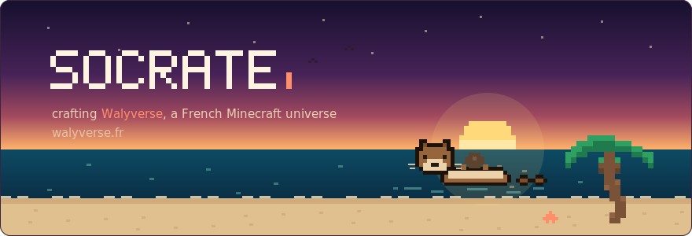

I'm building **[Walyverse](https://walyverse.fr)**, a French Minecraft universe, and I make nearly every piece of it myself:

- **The gameplay**: an ecosystem of 35+ custom Java plugins & systems (economy, jobs, items, chat, teleportation, votes, cross-server sync, i18n, and more)
- **The network**: a whole fleet of servers behind one proxy, kept in sync and live for real players
- **The infrastructure**: [Ferry](https://ferry.walyverse.fr), my own deployment platform that ships files across every server of the fleet, safely

🌴 [walyverse.fr](https://walyverse.fr)&ensp;&ensp;🐦 [@Seiiiki_](https://x.com/Seiiiki_)&ensp;&ensp;💬 @seiiki_ on Discord
