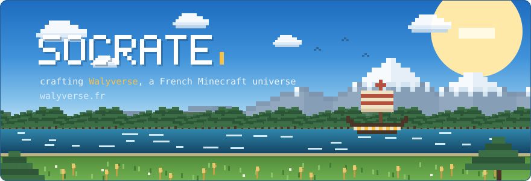

I'm building **[Walyverse](https://walyverse.fr)**, a French Minecraft universe, and I make nearly every piece of it myself — from the plugins players click on to the machines they run on.

- **The gameplay**: an ecosystem of 35+ custom Java plugins & systems (Paper/Folia 1.21+, Java 25) — economy, jobs, a fully player-run market, crates, items, chat, teleportation, votes, displays, menus, i18n. MySQL as the single source of truth, Redis for everything cross-server.
- **The network**: a whole fleet of servers behind one Velocity proxy, kept in sync player by player, live for real players. Instances wake up when people show up and shut down when they leave, driven by Redis heartbeats and YAML rules on top of Pterodactyl.
- **The infrastructure**: [Ferry](https://ferry.walyverse.fr), my own deployment platform that ships files across every server of the fleet, safely.
- **The web**: Ferry's whole dashboard side, custom Azuriom theme work for the site, and an in-game Stripe store with a Node backend that delivers purchases even when the buyer is offline.

A few of the pieces:

- **Menu** — a YAML menu & dialog engine that every other plugin builds its interface on, editors included
- **I18n** — one jar for Paper, Folia and Velocity: per-player locale synced across servers, plus packet rewriting to translate third-party plugins
- **Market** — player shops, auction house, buy orders and direct trades on a single transactional engine (ledger, escrow, anti-dupe)
- **Auth** — proxy-side login that replaced JPremium without a single player having to reset their password
- **Orchestrator** — Minecraft instances that scale with the player count, no human in the loop

Everything on this profile, banner included, is drawn by my own scripts. No generators, no templates.

🌴 [walyverse.fr](https://walyverse.fr)&ensp;&ensp;🐦 [@Seiiiki_](https://x.com/Seiiiki_)&ensp;&ensp;💬 @seiiki_ on Discord
